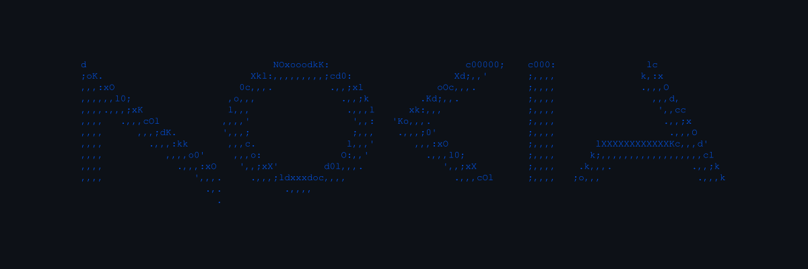
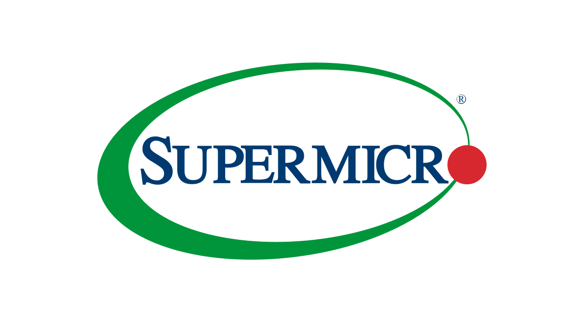

  
  <h1>Nokia Summer Practice - Cloud AI RAN</h1>
   
  

    <b>OS & Scripting</b> 
    
    
    
    
  

  

    <b>Container & Orchestration</b> 
    
    
    
  

  

    <b>Infrastructure & Virtualization</b> 
    
    
    
    
  

  

    <b>Networking & Services</b> 
    
    
  

This repository contains tasks, demos, and individual research projects related to my summer practice at Nokia in the Cloud department. It includes automated lab environments, configurations, and documentation for testing various core network services and infrastructure components. 

## Getting Started

Each component is self-contained. Navigate to any of the subdirectories to view the specific `README.md`, deployment instructions, and test commands for that particular environment.
