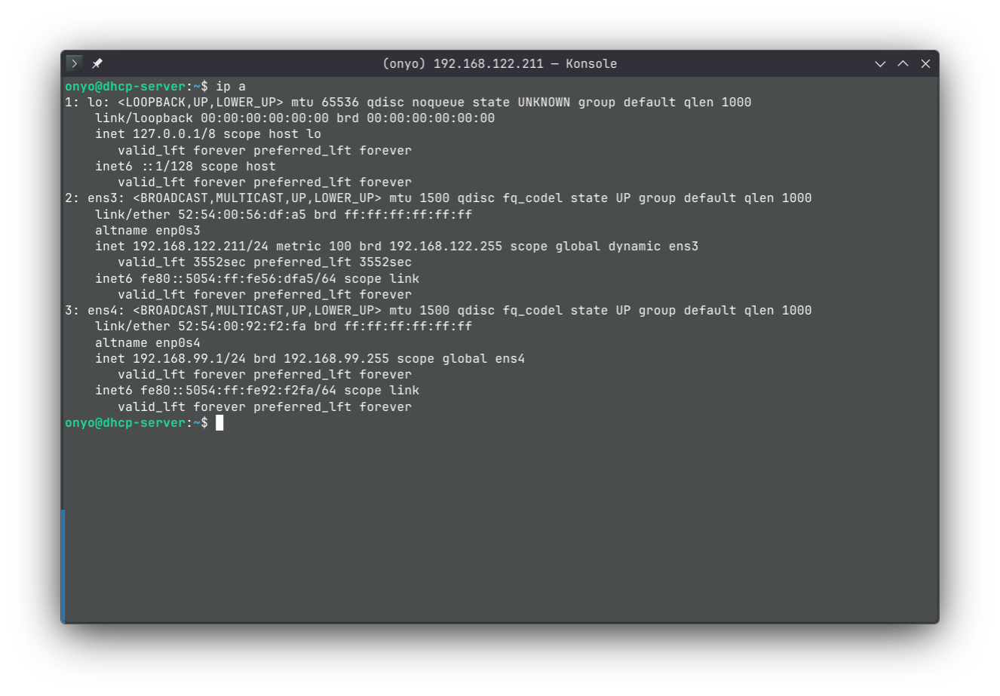
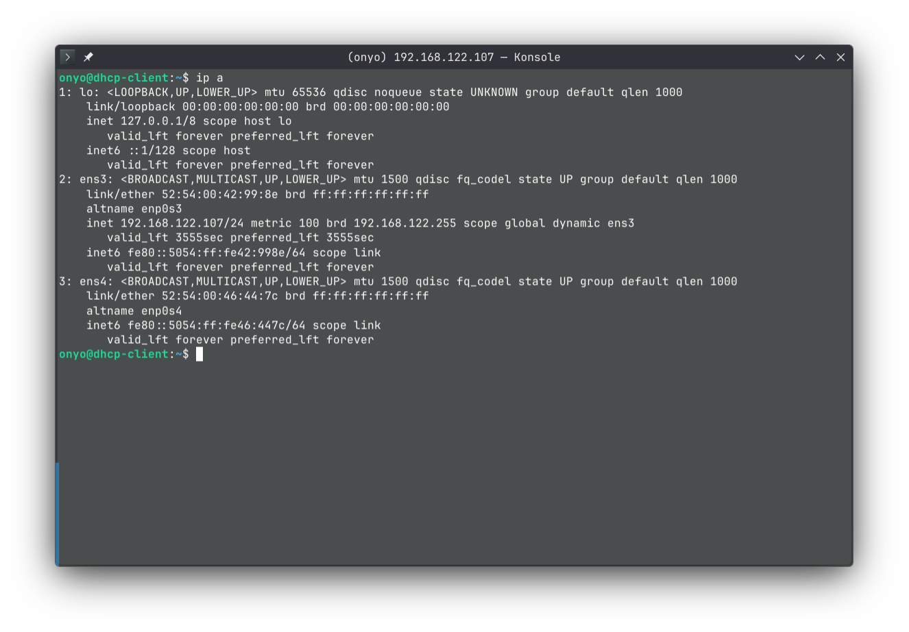
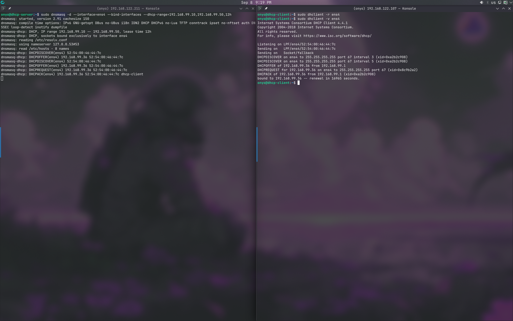
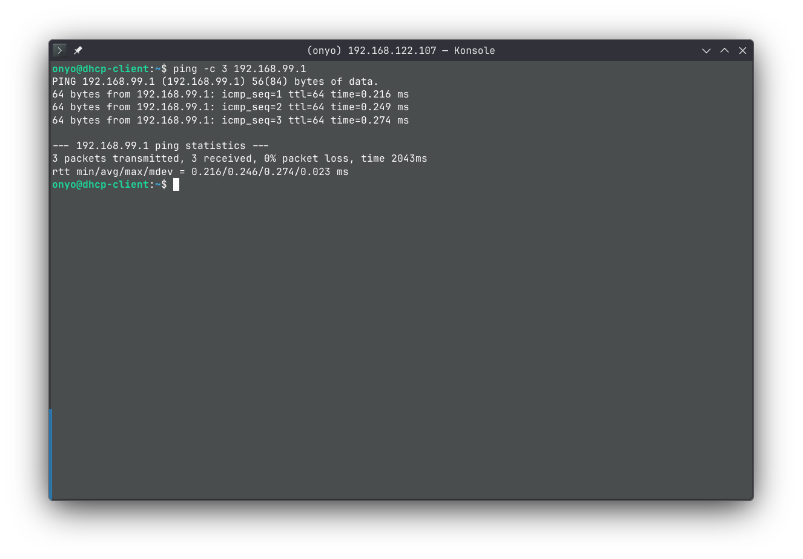
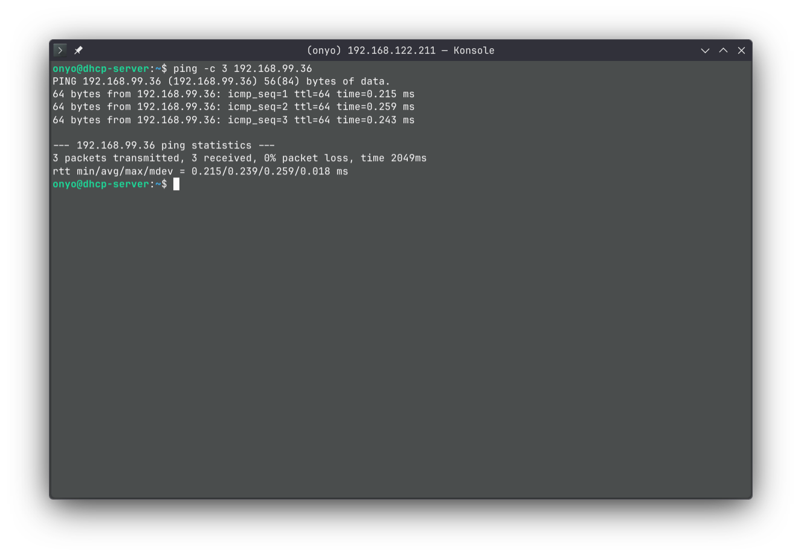

# DHCP Server Demo with dnsmasq

This provisions an isolated virtual environment to test a local DHCP server using `dnsmasq`. It uses Terraform and Libvirt to automatically spin up a Server and a Client VM on an isolated network.

## Prerequisites

- [Terraform](https://www.terraform.io/)
- [Libvirt (KVM/QEMU)](https://libvirt.org/)
- `cdrtools`

## 1. Provisioning the VMs

Start the virtual machines using Terraform. This will automatically download the Ubuntu 22.04 base image, configure the networks (via Netplan), and initialize the VMs.

```bash
terraform init
terraform apply -auto-approve
```

Once complete, Terraform will output the management SSH IPs for both VMs:
- `server_management_ip` (e.g., `192.168.122.3`)
- `client_management_ip` (e.g., `192.168.122.4`)

SSH into both machines in separate terminals:
```bash
ssh onyo@<server_management_ip>
ssh onyo@<client_management_ip>
```

### Network Architecture
Each VM is provisioned with two network interfaces:
- **`ens3` (Management)**: Connected to the default Libvirt NAT network. This provides internet access and is used to SSH into the VMs.
- **`ens4` (Isolated Testing)**: Connected to a completely isolated bridge (`dhcp-test-net`). This is a private link strictly between the Server and Client VMs for testing `dnsmasq` without outside interference.

*Note: Cloud-Init automatically configures `ens4` on the server with a static IP of `192.168.99.1/24`, and leaves the client's `ens4` ready to request an IP.*

**Server Interfaces (Before DHCP)**
<p align="center">
  
</p>

**Client Interfaces (Before DHCP)**
<p align="center">
  
</p>

---

## 2. Starting the DHCP Server

On the **Server VM**, start `dnsmasq` in foreground/debug mode (`-d`). 

This command binds to the isolated interface (`ens4`) and serves dynamic IP addresses between `.10` and `.50` with a 12-hour lease time:

```bash
sudo dnsmasq -d --interface=ens4 --bind-interfaces --dhcp-range=192.168.99.10,192.168.99.50,12h
```

---

## 3. Testing the Client

On the **Client VM**, use `dhclient` to request an IP address over the isolated network.

Release any existing leases on `ens4` (if any):
```bash
sudo dhclient -r ens4
```

Request a new IP address in verbose mode to view the DHCP transaction details:
```bash
sudo dhclient -v ens4
```

**DHCP DORA Process**
<p align="center">
  
</p>

---

## 4. Testing Connectivity

Verify bidirectional communication after the client successfully receives an IP address.

**Ping Server from Client**
```bash
ping -c 3 <server_ip>
```
<p align="center">
  
</p>

**Ping Client from Server**
Look at the output from `dnsmasq` or `dhclient` to find the assigned IP (e.g., `192.168.99.10`), and ping it from the server:
```bash
ping -c 3 <client_ip>
```
<p align="center">
  
</p>