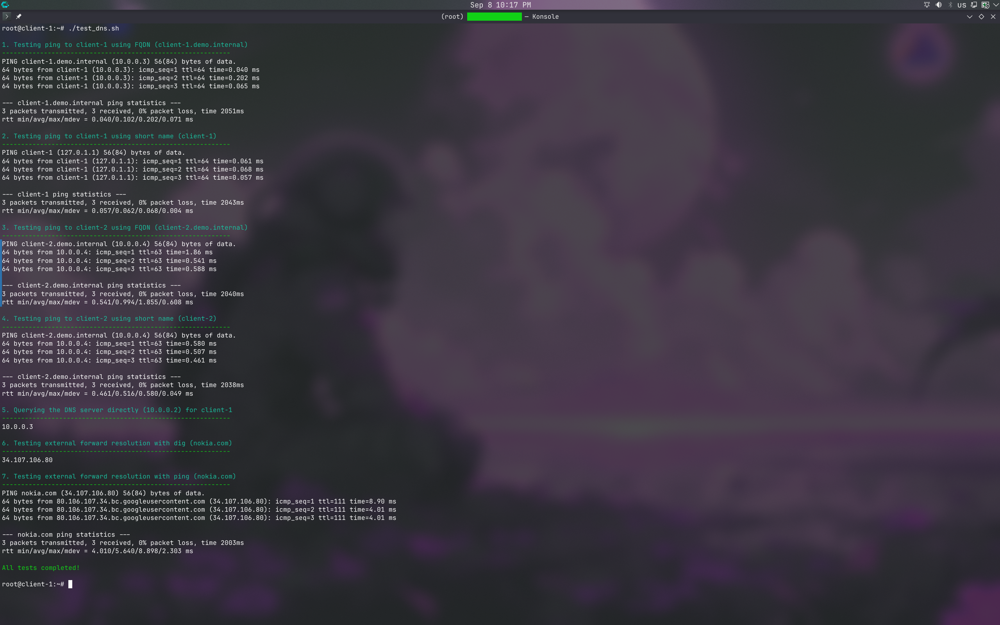

# DNS Demo on Hetzner Cloud

This is a Terraform demo of setting up a private DNS server (using BIND9) and connecting clients to it within a Hetzner Cloud private network.

## Prerequisites

- [Terraform](https://developer.hashicorp.com/terraform/downloads) installed.
- A Hetzner Cloud API Token.
- An SSH public key located at `~/.ssh/dns.pub`.

## Architecture

The Terraform configuration (`main.tf`) provisions the following resources on Hetzner Cloud:

- **Internal Network**: A private network (`10.0.0.0/16`) with a subnet (`10.0.0.0/24`) in the `eu-central` zone.
- **SSH Key**: Uploads a public key from `~/.ssh/dns.pub` for server access.
- **DNS Server (`dns-server`)**:
  - Ubuntu 24.04 VM (`cx23`).
  - Private IP: `10.0.0.2`.
  - Installs and configures BIND9 via `cloud-init` to serve the `demo.internal` zone.
- **Client 1 (`client-1`)**:
  - Ubuntu 24.04 VM (`cx23`).
  - Private IP: `10.0.0.3`.
  - Configures `systemd-resolved` to use the DNS server for resolution.
- **Client 2 (`client-2`)**:
  - Ubuntu 24.04 VM (`cx23`).
  - Private IP: `10.0.0.4`.
  - Configures `systemd-resolved` to use the DNS server for resolution.

All servers are automatically rebooted upon creation to initialize the Hetzner private network interfaces properly.

## Usage

1. **Initialize Terraform:**
   ```bash
   terraform init
   ```

2. **Apply the configuration:**
   You will be prompted for your Hetzner Cloud API token, or you can provide it via an environment variable `TF_VAR_hcloud_token` or an auto tfvars file.
   
   ```bash
   terraform apply -auto-approve
   ```

3. Note the output public IP addresses of the provisioned servers.

## Testing

Once the infrastructure is provisioned, you can SSH into `client-1` or `client-2` using their public IPs.

You can run the provided `test_dns.sh` script to automatically verify DNS resolution (it performs pings using FQDNs, short names, and tests external forward resolution). Simply copy the script to your client machine, make it executable, and run it:

```bash
chmod +x test_dns.sh
./test_dns.sh
```

<p align="center">
  
</p>

## Cleanup

To destroy the provisioned infrastructure and avoid further charges:
```bash
terraform destroy -auto-approve
```
