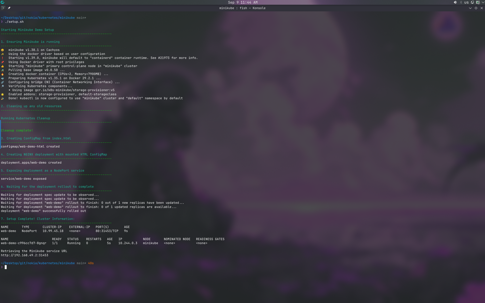
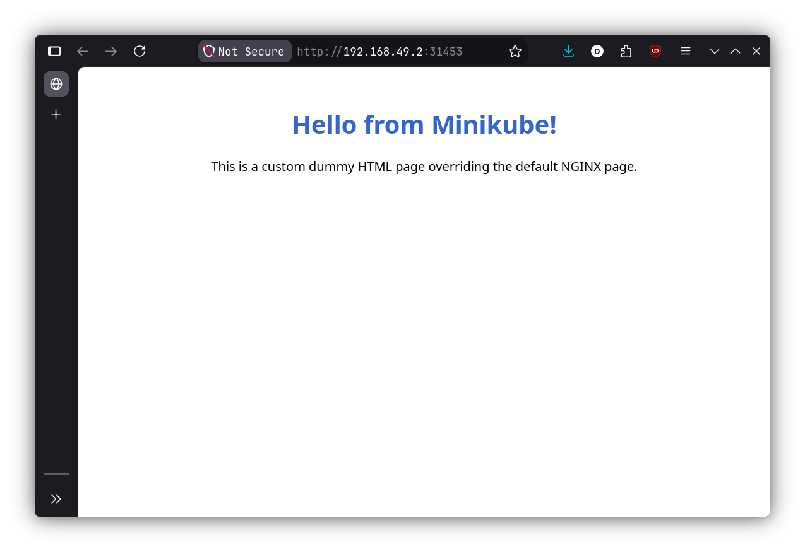
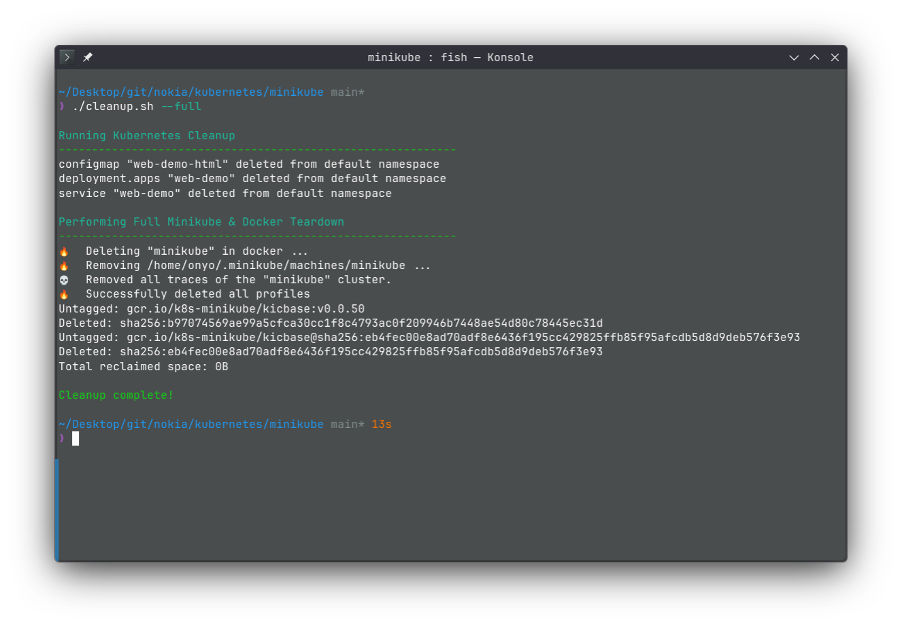

# Minikube Demo

This is a demo for a local Kubernetes cluster using Minikube and deploying a simple NGINX web server with a custom HTML page.

## Prerequisites

Before running this demo, ensure you have the following installed on your machine:
- **[Docker](https://docs.docker.com/get-docker/)**: Used as the virtualization driver for Minikube.
- **[Minikube](https://minikube.sigs.k8s.io/docs/start/)**: The local Kubernetes cluster environment.
- **[kubectl](https://kubernetes.io/docs/tasks/tools/)**: The Kubernetes command-line tool.

---

## 1. Setup & Deployment

You can automatically set up the cluster and deploy the application by running the provided `setup.sh` script.

### What it does:
- Starts Minikube using the Docker driver.
- Performs a quick internal cleanup to ensure a clean state.
- Creates a Kubernetes ConfigMap from the local `index.html` file.
- Declaratively creates the NGINX deployment (via `deployment.yaml`) with the ConfigMap mounted into the container.
- Exposes the deployment as a local NodePort service.
- Waits for the deployment to become ready and prints the URL to access it.

```bash
chmod +x setup.sh
./setup.sh
```

<p align="center">
  
</p>

---

## 2. Accessing the Application

Once the setup script finishes, it will print out a local URL. Visiting this URL in your web browser will display the custom HTML page served by the NGINX pod running inside your Minikube cluster.

<p align="center">
  
</p>

---

## 3. Cleaning Up

When you are finished with the demo, you can remove the created Kubernetes resources by running the dedicated cleanup script.

### What it does:
By default, the script cleanly deletes the Kubernetes ConfigMap, Deployment, and Service created by the setup script, leaving Minikube running for future use.

```bash
chmod +x cleanup.sh
./cleanup.sh
```

### Full Teardown (Minikube & Docker)

If you are completely done and want to fully destroy the Minikube cluster and clean your Docker environment, you can run the cleanup script with the `--full` flag. This will:
- Delete the entire Minikube cluster profile.
- Forcefully remove the Minikube Docker container.
- Remove the downloaded `kicbase` Docker images.
- Prune unused Docker networks and dangling images.

```bash
./cleanup.sh --full
```

<p align="center">
  
</p>
