# SR-IOV vs Bridge (No SR-IOV) Performance Comparison

This demonstrates the performance differences between using SR-IOV (Single Root I/O Virtualization) and a standard Linux Software Bridge for network traffic. The tests are performed on a bare metal Supermicro server. While in theory offloading network switching to the hardware NIC via SR-IOV should result in minimal CPU overhead, in this experiment both methods triggered usage across 2-3 CPU threads, showing not much difference in CPU load (though there are noticeable differences in throughput).

**Server Specifications:**
- **Type of the server blade:** Supermicro 5039MP-H8TNR

<p align="center">
  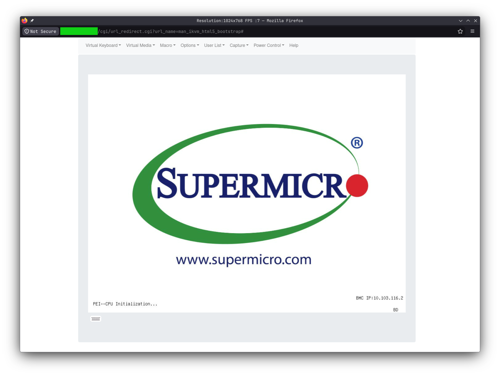
  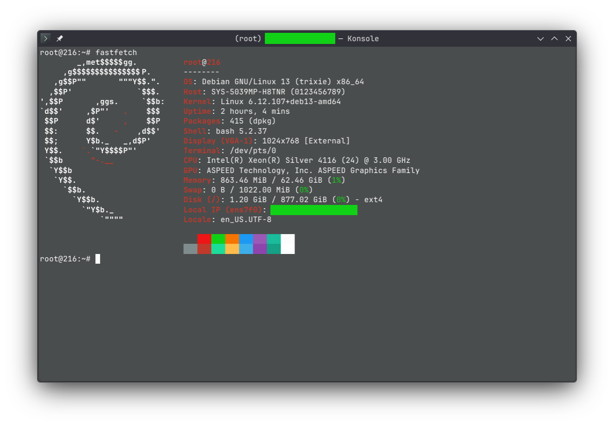
</p>

## Prerequisites

1. **Enable SR-IOV in BIOS:**

<p align="center">
  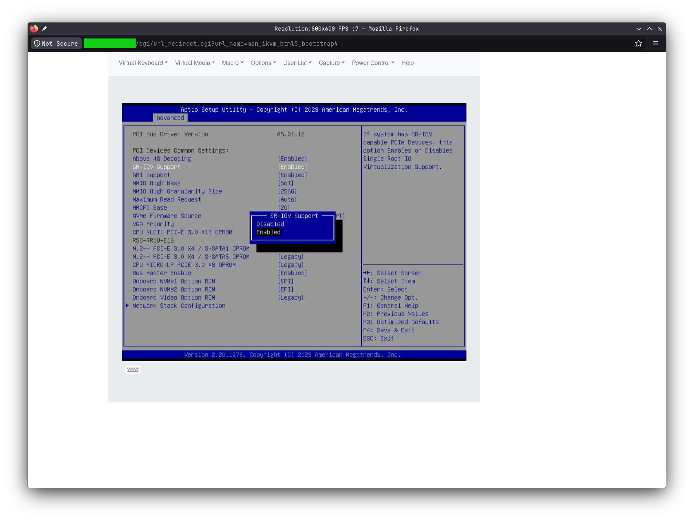
</p>

2. **Edit GRUB to enable IOMMU:**

<p align="center">
  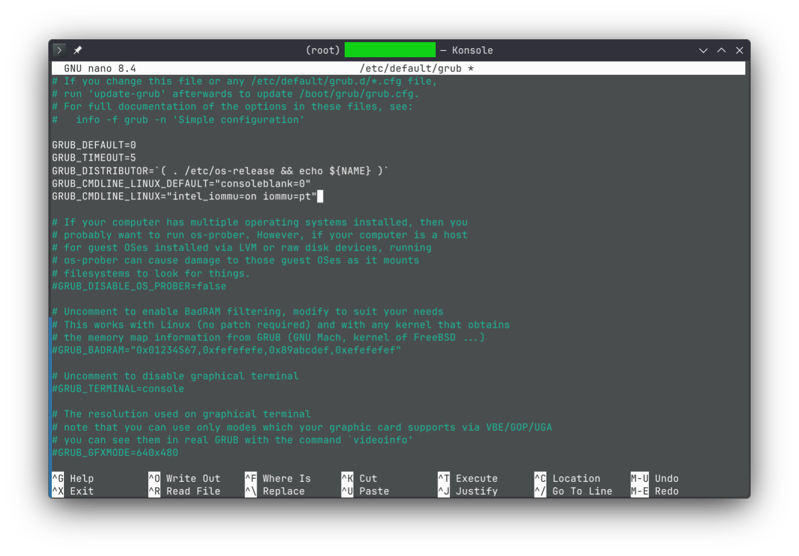
</p>

---

## 1. SR-IOV Configuration


*Note: You can run the steps in this section manually, or execute the provided `setup_sriov.sh` and `test_sriov.sh` scripts in the repository root for convenience. **Important:** If you use the scripts, be sure to open them and update the physical interface name (e.g., `ens7f0`) to match your system's network interface.*

### Setup Virtual Functions

```bash
# 1. Check if the interface supports SR-IOV and view total allowed VFs
cat /sys/class/net/ens7f0/device/sriov_totalvfs

# 2. Generate 2 Virtual Functions
sudo sh -c 'echo 2 > /sys/class/net/ens7f0/device/sriov_numvfs'

# 3. Check the newly created VF names (likely ens7f0v0 and ens7f0v1)
sudo ip link show | grep ens7f0
```
<p align="center">
  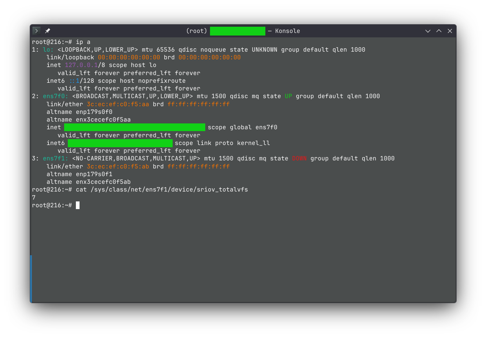
</p>

### Configure Namespaces

```bash
# 3. Create the two test namespaces
sudo ip netns add ns-hw1
sudo ip netns add ns-hw2

# 4. Move the VFs into the namespaces
sudo ip link set ens7f0v0 netns ns-hw1
sudo ip link set ens7f0v1 netns ns-hw2

# 5. Assign private IPs and bring them up
sudo ip netns exec ns-hw1 ip addr add 10.20.20.1/24 dev ens7f0v0
sudo ip netns exec ns-hw1 ip link set ens7f0v0 up
sudo ip netns exec ns-hw1 ip link set lo up

sudo ip netns exec ns-hw2 ip addr add 10.20.20.2/24 dev ens7f0v1
sudo ip netns exec ns-hw2 ip link set ens7f0v1 up
sudo ip netns exec ns-hw2 ip link set lo up
```
<p align="center">
  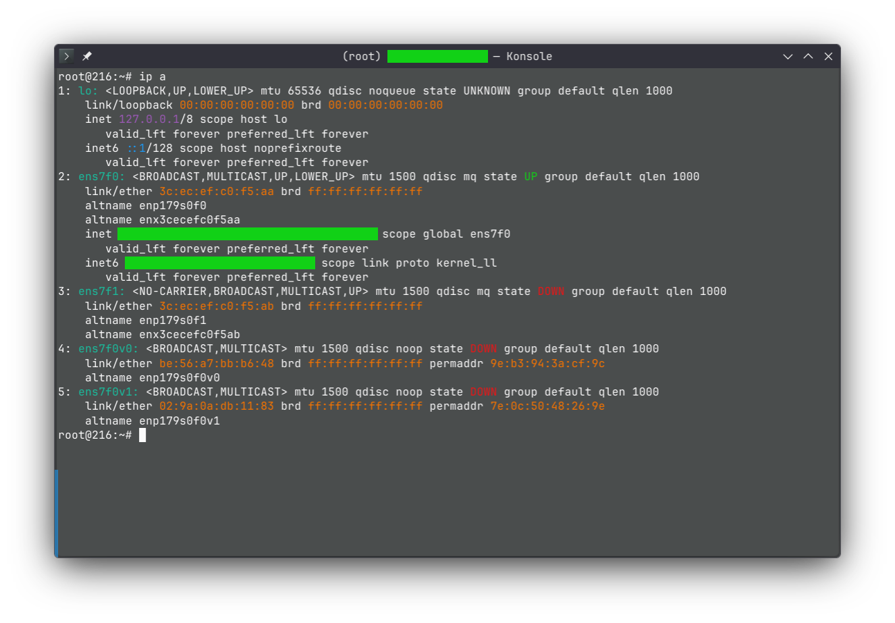
</p>

### Connectivity and Performance Testing

```bash
# 6. Test direct communication between the two VFs
sudo ip netns exec ns-hw1 ping -c 3 10.20.20.2
sudo ip netns exec ns-hw2 ping -c 3 10.20.20.1
```
<p align="center">
  
</p>

```bash
# Start the iperf3 server in the first namespace
sudo ip netns exec ns-hw1 iperf3 -s -D

# Run a heavy UDP traffic flood from the second namespace
sudo ip netns exec ns-hw2 iperf3 -c 10.20.20.1 -u -b 10G -l 64 -t 60
```
<p align="center">
  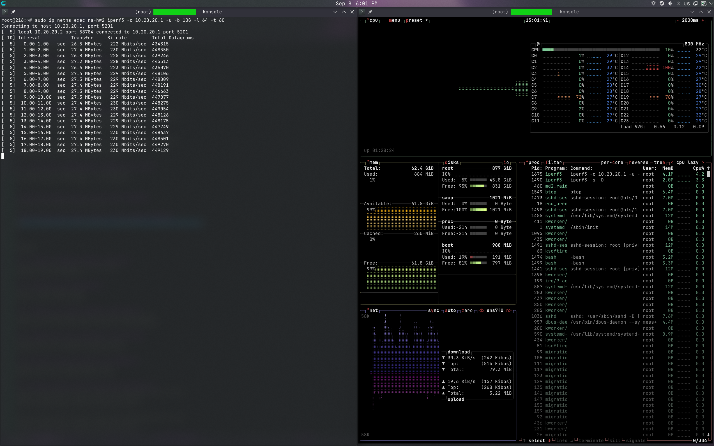
</p>

<p align="center">
  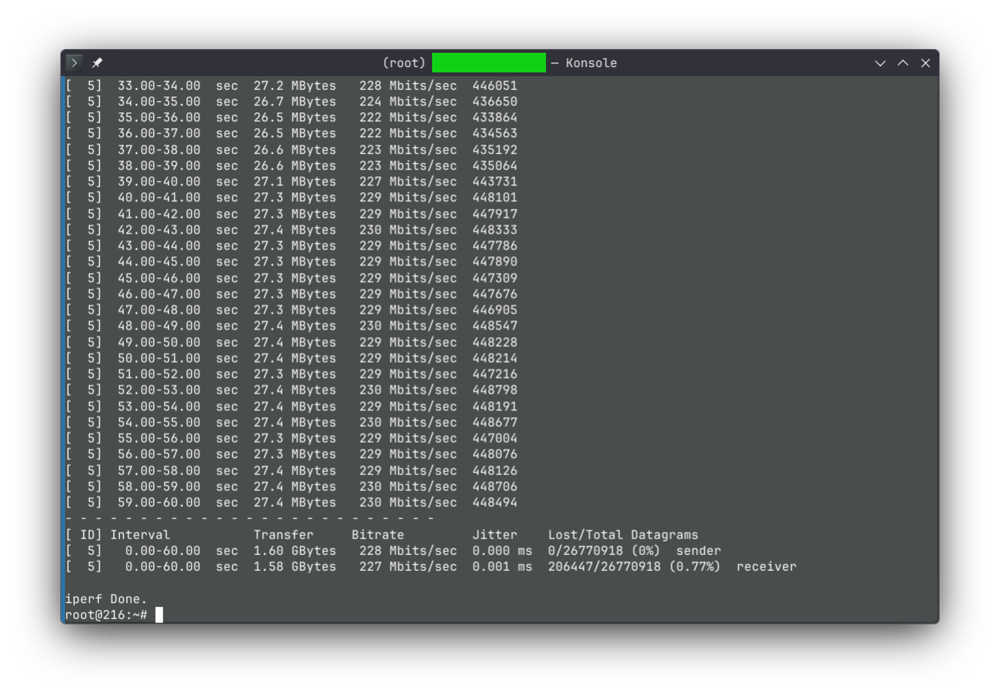
</p>

**SR-IOV Test Results Explanation:**
When using SR-IOV, the network traffic is routed directly through the physical NIC's hardware switch via Virtual Functions (VFs), bypassing the host operating system's networking stack. In theory, this approach should require minimal host CPU resources. However, in our experiment (as seen in the `btop` results), it still triggered usage across 2-3 threads, showing not much difference in CPU consumption compared to the software bridge.

---

## 2. Bridge Configuration (No SR-IOV)


*Note: You can run the steps in this section manually, or execute the provided `setup_bridge.sh` and `test_bridge.sh` scripts in the repository root for convenience. **Important:** If you use the scripts, be sure to open them and update the interface names to match your system's network configuration if necessary.*

### Setup Bridge and Namespaces

```bash
# 1. Create a software bridge on the host
sudo ip link add name br0 type bridge
sudo ip link set br0 up

# 2. Create two test namespaces
sudo ip netns add ns-sw1
sudo ip netns add ns-sw2

# 3. Create two virtual ethernet (veth) pairs
sudo ip link add veth1 type veth peer name veth1-br
sudo ip link add veth2 type veth peer name veth2-br

# 4. Attach one end of each pair to the bridge
sudo ip link set veth1-br master br0 up
sudo ip link set veth2-br master br0 up

# 5. Push the other ends into the namespaces
sudo ip link set veth1 netns ns-sw1
sudo ip link set veth2 netns ns-sw2

# 6. Assign private IPs and bring the interfaces up
sudo ip netns exec ns-sw1 ip addr add 10.30.30.1/24 dev veth1
sudo ip netns exec ns-sw1 ip link set veth1 up
sudo ip netns exec ns-sw1 ip link set lo up

sudo ip netns exec ns-sw2 ip addr add 10.30.30.2/24 dev veth2
sudo ip netns exec ns-sw2 ip link set veth2 up
sudo ip netns exec ns-sw2 ip link set lo up
```
<p align="center">
  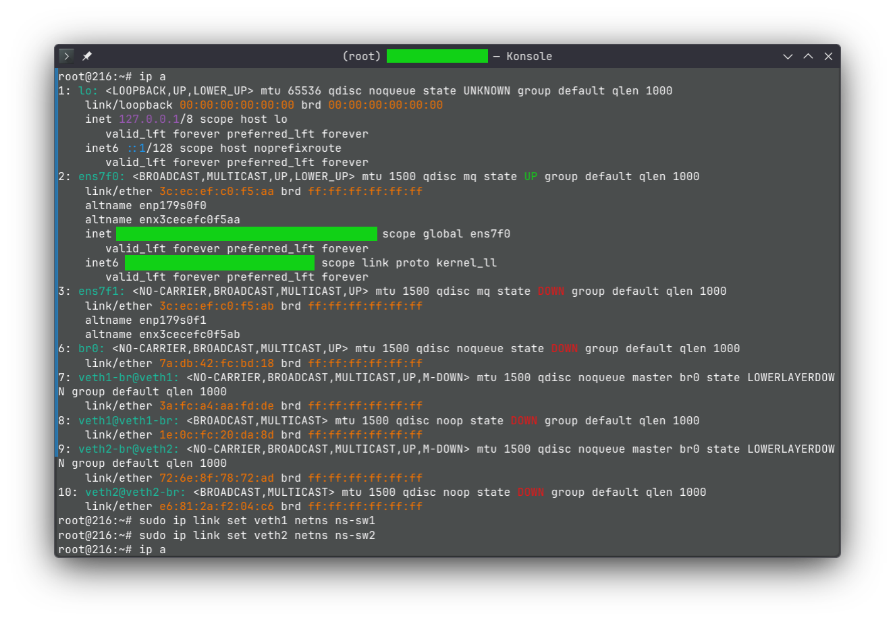
</p>

### Connectivity and Performance Testing

```bash
# 7. Test direct communication
sudo ip netns exec ns-sw1 ping -c 3 10.30.30.2
sudo ip netns exec ns-sw2 ping -c 3 10.30.30.1
```
<p align="center">
  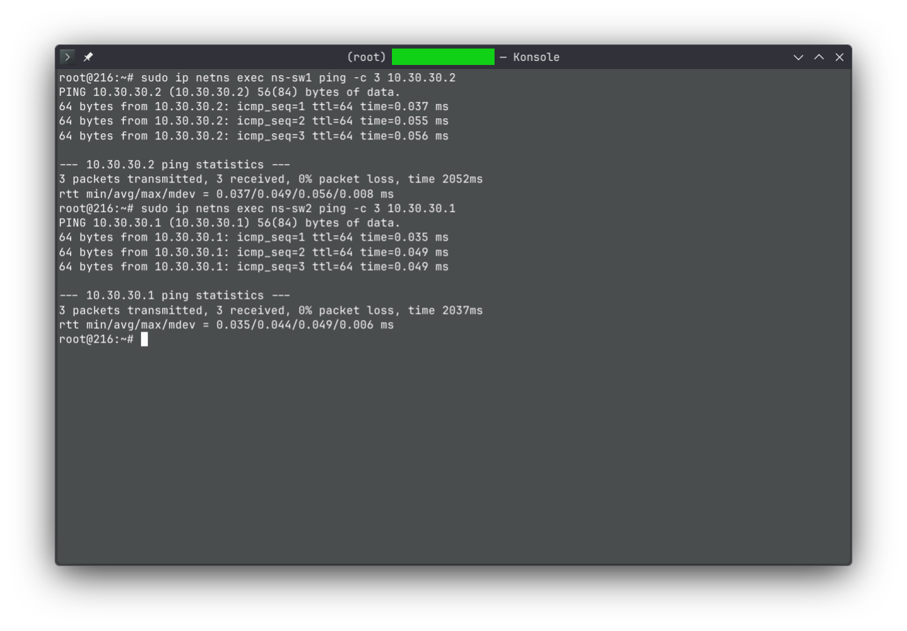
</p>

```bash
# Start the iperf3 server in the first software namespace
sudo ip netns exec ns-sw1 iperf3 -s -D

# Run the heavy UDP traffic flood from the second software namespace
sudo ip netns exec ns-sw2 iperf3 -c 10.30.30.1 -u -b 10G -l 64 -t 60
```
<p align="center">
  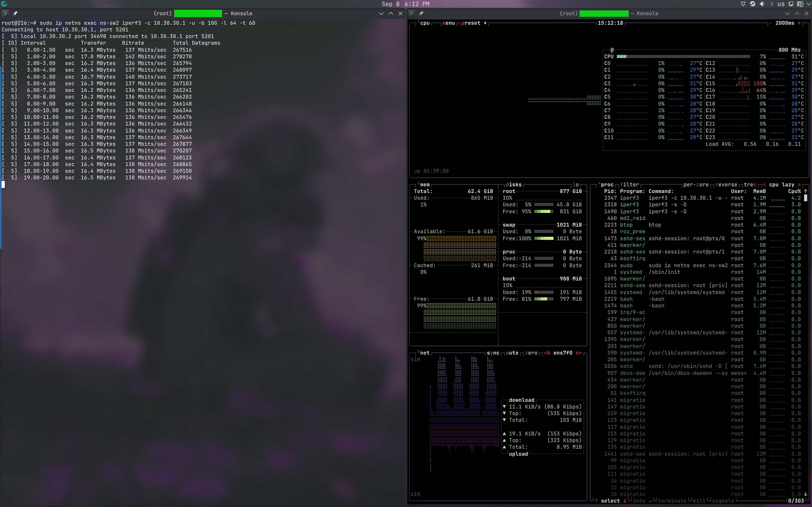
</p>

<p align="center">
  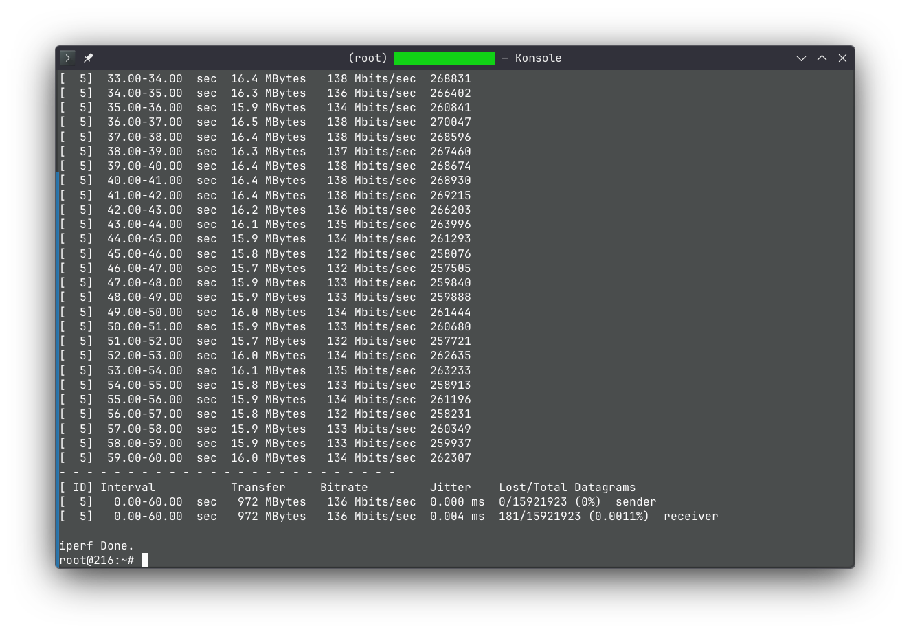
</p>

**Bridge Test Results Explanation:**
With a standard software bridge, the host's CPU must actively process and forward every network packet between the namespaces. While we expected this software-based switching to consume significantly more CPU overhead than SR-IOV, the `btop` results showed it triggering a similar 2-3 threads of usage, indicating not much difference in CPU load between the two methods under this specific test scenario.

---

## 3. Performance Results Summary

Here is a summary of the `iperf3` benchmark results comparing both approaches under the 10G UDP flood test.

While CPU usage was observed to be similar between both methods (2-3 threads), **SR-IOV** demonstrated clear performance advantages in **throughput** (1.60 GBytes vs 972 MBytes) and **delay/jitter** (0.001 ms vs 0.004 ms). It is worth noting that under this heavy 10G UDP flood, SR-IOV did experience a slightly higher **packet loss** rate (0.77%) compared to the Software Bridge (0.0011%).

<div align="center">

| Metric | Software Bridge (No SR-IOV) | Hardware (SR-IOV) |
| :--- | :--- | :--- |
| **Total Transfer** | 972 MBytes | 1.60 GBytes |
| **Bitrate** | 136 Mbits/sec | 228 Mbits/sec |
| **Total Datagrams Sent** | 15,921,923 | 26,770,918 |
| **Jitter** | 0.004 ms | 0.001 ms |
| **Packet Loss** | 0.0011% (181 lost) | 0.77% (206,447 lost) |

</div>

